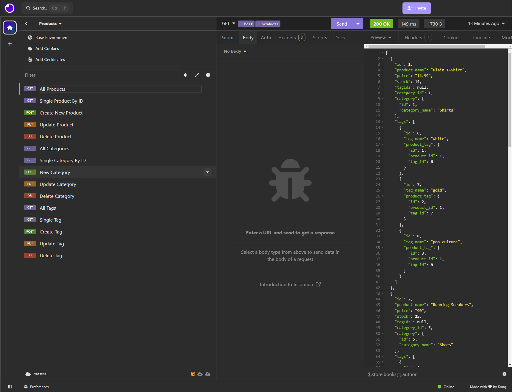
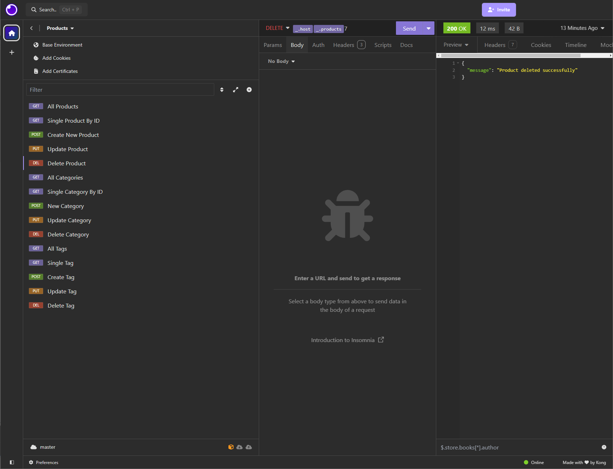

# E-Commerce Back End Project

[](https://opensource.org/licenses/MIT)

[Watch the Demo Video](https://drive.google.com/file/d/15xoCAz7bD8I9JDRIqkSShGtzT2HY6ZtQ/view?usp=drive_link)

## What is This Project?

This project is a Node.js application that serves as the back end for an e-commerce website using PostgreSQL.

- **Why Did I Make This?**: To improve my skills in Node.js, PostgreSQL, and creating APIs for managing e-commerce databases.
- **What's in It?**: The application allows the user to view categories, products, and tags; add new categories, products, and tags; and update or delete existing records. The data is stored in a PostgreSQL database.
- **What Did I Learn?**: This project helped me learn more about creating RESTful APIs in Node.js, handling user input with Insomnia, and interacting with PostgreSQL databases using Sequelize.

## Table of Contents

Explore the contents of this guide:

- [Installation](#installation)
- [Usage](#usage)
- [Credits](#credits)
- [License](#license)

## Installation

To run this project locally:
1. Clone the repository.
2. Navigate to the project directory.
3. Install the dependencies using `npm install`.
4. Set up the PostgreSQL database.

## Usage

1. Start the PostgreSQL server.
2. Create the database and set up the schema:
    ```bash
    psql -U postgres
    \i db/schema.sql
    ```
3. Seed the database with initial data:
    ```bash
    npm run seed
    ```
4. Create an `.env` file with your PostgreSQL credentials:
    ```env
    DB_NAME=ecommerce_db
    DB_USER=your_postgresql_username
    DB_PASSWORD=your_postgresql_password
    ```
5. Run the application using the command:
    ```bash
    npm start
    ```
6. Use Insomnia to test the API endpoints:
    - **GET** `/api/categories` to view all categories.
    - **GET** `/api/categories/:id` to view a single category by ID.
    - **POST** `/api/categories` to add a new category.
    - **PUT** `/api/categories/:id` to update a category by ID.
    - **DELETE** `/api/categories/:id` to delete a category by ID.
    - **GET** `/api/products` to view all products.
    - **GET** `/api/products/:id` to view a single product by ID.
    - **POST** `/api/products` to add a new product.
    - **PUT** `/api/products/:id` to update a product by ID.
    - **DELETE** `/api/products/:id` to delete a product by ID.
    - **GET** `/api/tags` to view all tags.
    - **GET** `/api/tags/:id` to view a single tag by ID.
    - **POST** `/api/tags` to add a new tag.
    - **PUT** `/api/tags/:id` to update a tag by ID.
    - **DELETE** `/api/tags/:id` to delete a tag by ID.

## Sample Screenshots

Here are some screenshots demonstrating the application's functionality:

### GET Request


### DELETE Request


## Credits

A heartfelt thank you to my bootcamp instructors and peers for their continuous guidance and support. Special thanks to:

- [MDN Web Docs](https://developer.mozilla.org/en-US/) for their comprehensive resources on JavaScript and PostgreSQL.
- [Stack Overflow](https://stackoverflow.com/) for providing solutions to coding issues.
- [Node.js Documentation](https://nodejs.org/en/docs/) for detailed information on Node.js features.
- [Insomnia Documentation](https://docs.insomnia.rest/) for instructions on testing API endpoints.
- [PostgreSQL Documentation](https://www.postgresql.org/docs/) for detailed information on PostgreSQL features and SQL syntax.

## License

MIT License 

Permission is hereby granted, free of charge, to any person obtaining a copy of this software and associated documentation files (the "Software"), to deal in the Software without restriction, including without limitation the rights to use, copy, modify, merge, publish, distribute, sublicense, and/or sell copies of the Software, and to permit persons to whom the Software is furnished to do so, subject to the following conditions:

The above copyright notice and this permission notice shall be included in all copies or substantial portions of the Software.

THE SOFTWARE IS PROVIDED "AS IS", WITHOUT WARRANTY OF ANY KIND, EXPRESS OR IMPLIED, INCLUDING BUT NOT LIMITED TO THE WARRANTIES OF MERCHANTABILITY, FITNESS FOR A PARTICULAR PURPOSE AND NONINFRINGEMENT. IN NO EVENT SHALL THE AUTHORS OR COPYRIGHT HOLDERS BE LIABLE FOR ANY CLAIM, DAMAGES, OR OTHER LIABILITY, WHETHER IN AN ACTION OF CONTRACT, TORT OR OTHERWISE, ARISING FROM, OUT OF OR IN CONNECTION WITH THE SOFTWARE OR THE USE OR OTHER DEALINGS IN THE SOFTWARE.